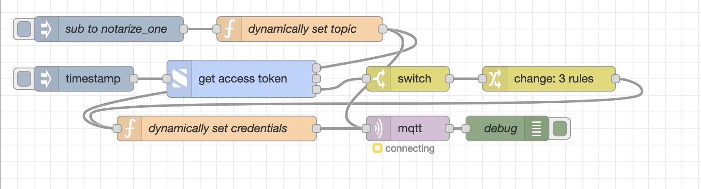

# node-red-s1seven-api

## Introduction

This is a custom node that wraps the S1Seven [API](https://developers.s1seven.com/docs/openapi/) in several custom nodes that can be used in Node-Red. There is a separate node available for each endpoint which can be found in the S1Seven category in the Palette on the left-hand side of the screen.

The endpoints that are currently available are `hash`, `validate`, `notarize`, `get a company by id` and `get identities`. All of these nodes share a single `config` node, which allows you to easily set the `access token`, `company id`, `mode` and `environment`.

## Usage

To notarize, hash or validate a certificate, simply pass in a valid JSON certificate as `msg.payload` or add it to `global.certificate`. Each node is thoroughly documented with a help text in the sidebar. To access it, select an S1Seven node, and click on the book icon on the top right of the screen (underneath the `Deploy` button). There you can see what input is required by each individual node.

Each node simply takes the required input via the config ui or the `msg` object, and outputs the `data` property of the response.

## Authentication

To authenticate a request, the api nodes look for an access token in the `msg.accessToken` property or in the global context `s1sevenAccessToken` property. The access token is automatically set in the global context when a request is made from the `get access token` node. To use the `get access token` node, simply add your application `clientId` and `clientSecret` to the config node, and send a request. To learn more, click [here](https://manual.s1seven.com/automation/#applications-and-access-tokens).

Access tokens expire after 24 hours. There are several ways to automate the renewal of access tokens, one example can be seen below:


In the screenshot, the `hash` node has 2 outputs, the first labeled `success`, and the second `fail`. The `fail` output is linked to a `switch` node. The `switch` looks at the property `msg.payload.statusCode` and checks to see if the code is `401`, which means the request is unauthorized. If the code is `401`, it sends the payload to the `get access token` node, which automatically requests a new access token and makes available in the global context, along with the `mode`.


A minimal example of the above workflow can be imported using the following JSON file:

```json
[
  {
    "id": "e2b2aaef3e997b7b",
    "type": "hash",
    "z": "155da1287ae6504d",
    "name": "",
    "apiConfig": "16bd3e4db46db980",
    "algorithm": "sha256",
    "encoding": "hex",
    "x": 290,
    "y": 380,
    "wires": [["6befa51db92df9f8"], ["290656f39a923100"]]
  },
  {
    "id": "1f69af6a87ecfb24",
    "type": "inject",
    "z": "155da1287ae6504d",
    "name": "",
    "props": [
      {
        "p": "payload"
      },
      {
        "p": "topic",
        "vt": "str"
      }
    ],
    "repeat": "",
    "crontab": "",
    "once": false,
    "onceDelay": 0.1,
    "topic": "",
    "payload": "{}",
    "payloadType": "json",
    "x": 110,
    "y": 380,
    "wires": [["e2b2aaef3e997b7b"]]
  },
  {
    "id": "6befa51db92df9f8",
    "type": "debug",
    "z": "155da1287ae6504d",
    "name": "debug",
    "active": true,
    "tosidebar": true,
    "console": false,
    "tostatus": false,
    "complete": "true",
    "targetType": "full",
    "statusVal": "",
    "statusType": "auto",
    "x": 730,
    "y": 380,
    "wires": []
  },
  {
    "id": "290656f39a923100",
    "type": "switch",
    "z": "155da1287ae6504d",
    "name": "",
    "property": "payload.statusCode",
    "propertyType": "msg",
    "rules": [
      {
        "t": "eq",
        "v": "401",
        "vt": "num"
      }
    ],
    "checkall": "true",
    "repair": false,
    "outputs": 1,
    "x": 470,
    "y": 460,
    "wires": [["fd323fdf31455b44"]],
    "outputLabels": ["401"]
  },
  {
    "id": "fd323fdf31455b44",
    "type": "get access token",
    "z": "155da1287ae6504d",
    "name": "",
    "apiConfig": "16bd3e4db46db980",
    "x": 630,
    "y": 280,
    "wires": [["6befa51db92df9f8"], ["6befa51db92df9f8"]]
  },
  {
    "id": "7ff5a6d4faf5af58",
    "type": "catch",
    "z": "155da1287ae6504d",
    "name": "",
    "scope": null,
    "uncaught": false,
    "x": 100,
    "y": 440,
    "wires": [[]]
  },
  {
    "id": "68825bef95c36270",
    "type": "inject",
    "z": "155da1287ae6504d",
    "name": "",
    "props": [
      {
        "p": "payload"
      },
      {
        "p": "topic",
        "vt": "str"
      }
    ],
    "repeat": "",
    "crontab": "",
    "once": false,
    "onceDelay": 0.1,
    "topic": "",
    "payload": "",
    "payloadType": "date",
    "x": 120,
    "y": 280,
    "wires": [["fd323fdf31455b44"]]
  },
  {
    "id": "16bd3e4db46db980",
    "type": "api-config",
    "environment": "staging",
    "companyId": "",
    "name": "Staging",
    "apiVersion": "1"
  }
]
```

## Dynamic MQTT authentication

You can connect to MQTT dynamically by passing in messages, a simple example can be seen below:



First, you must inject the `dynamically set topic` node, then the `get access token` node. The `get access token` node has a `switch` node connected to its third output, labeled `event`. The `switch` node checks to see if the property `value` is `true`, meaning that the access token has changed and the MQTT node should be restarted.

Then, the `change` node sets the property `action` to `connect`, passes the following object to `broker`: 
```js
{   "credentials": { "user": "", "password": "" },   "force": true,   "clientid": "" }
```
And the `vhost` to the property `vhost`. Note: you must contact S1SEVEN to get access to the `vhost`.
The following function node sets the `user`, `password` and `clientid` values dynamically based on the values that have been passed to it and the values stored in the global context.

When the message reaches the MQTT node, it will restart with the updated values. This is just an example, feel free to adapt it to your needs.


You can import this example flow:

```json
[
  {
    "id": "e8ee392a67a85bbc",
    "type": "debug",
    "z": "155da1287ae6504d",
    "name": "debug",
    "active": true,
    "tosidebar": true,
    "console": false,
    "tostatus": false,
    "complete": "true",
    "targetType": "full",
    "statusVal": "",
    "statusType": "auto",
    "x": 610,
    "y": 640,
    "wires": []
  },
  {
    "id": "2f865f1cbe2da7a6",
    "type": "mqtt in",
    "z": "155da1287ae6504d",
    "name": "",
    "topic": "",
    "qos": "1",
    "datatype": "json",
    "broker": "a8c451b01c36c58a",
    "nl": false,
    "rap": true,
    "rh": 0,
    "inputs": 1,
    "x": 490,
    "y": 640,
    "wires": [["e8ee392a67a85bbc"]]
  },
  {
    "id": "416926352fcf0263",
    "type": "inject",
    "z": "155da1287ae6504d",
    "name": "",
    "props": [
      {
        "p": "payload"
      }
    ],
    "repeat": "",
    "crontab": "",
    "once": false,
    "onceDelay": 0.1,
    "topic": "",
    "payload": "",
    "payloadType": "date",
    "x": 100,
    "y": 580,
    "wires": [["8d4b2a81aac3257e"]]
  },
  {
    "id": "f9087dfd752dc996",
    "type": "change",
    "z": "155da1287ae6504d",
    "name": "",
    "rules": [
      {
        "t": "set",
        "p": "action",
        "pt": "msg",
        "to": "connect",
        "tot": "str"
      },
      {
        "t": "set",
        "p": "broker",
        "pt": "msg",
        "to": "{   \"credentials\": { \"user\": \"\", \"password\": \"\" },   \"force\": true,   \"clientid\": \"\" }",
        "tot": "json"
      },
      {
        "t": "set",
        "p": "vhost",
        "pt": "msg",
        "to": "jbjwikqf",
        "tot": "str"
      }
    ],
    "action": "",
    "property": "",
    "from": "",
    "to": "",
    "reg": false,
    "x": 660,
    "y": 580,
    "wires": [["7e6bf0caea59e270"]]
  },
  {
    "id": "7e6bf0caea59e270",
    "type": "function",
    "z": "155da1287ae6504d",
    "name": "dynamically set credentials",
    "func": "// Set this to the name of the current Config node\nconst environmentName = 'Staging';\nconst companyId = global.get(`S1SEVEN_COMPANY_ID_${environmentName}`);\nconst accessToken = global.get(`S1SEVEN_ACCESS_TOKEN_${environmentName}`);\n// vhost should be injected to msg.vhost\nmsg.broker.credentials.user = `${msg.vhost}:${companyId}`;\nmsg.broker.credentials.password = accessToken;\nmsg.broker.clientid = `company_${companyId}_node-red`;\nreturn msg;\n",
    "outputs": 1,
    "noerr": 0,
    "initialize": "",
    "finalize": "",
    "libs": [],
    "x": 260,
    "y": 640,
    "wires": [["2f865f1cbe2da7a6"]]
  },
  {
    "id": "1cfc3e145a7167c4",
    "type": "inject",
    "z": "155da1287ae6504d",
    "name": "sub to notarize_one",
    "props": [
      {
        "p": "action",
        "v": "subscribe",
        "vt": "str"
      },
      {
        "p": "topic",
        "v": "{\"topic\":\"\",\"qos\":1}",
        "vt": "json"
      }
    ],
    "repeat": "",
    "crontab": "",
    "once": false,
    "onceDelay": "1",
    "topic": "",
    "x": 130,
    "y": 520,
    "wires": [["e2d687811ecc840d"]]
  },
  {
    "id": "e2d687811ecc840d",
    "type": "function",
    "z": "155da1287ae6504d",
    "name": "dynamically set topic",
    "func": "const companyId = global.get('S1SEVEN_COMPANY_ID_Staging');\nmsg.topic.topic = `company/${companyId}/test/certificates/notarize_one`;\nreturn msg;",
    "outputs": 1,
    "noerr": 0,
    "initialize": "",
    "finalize": "",
    "libs": [],
    "x": 360,
    "y": 520,
    "wires": [["7e6bf0caea59e270", "2f865f1cbe2da7a6"]]
  },
  {
    "id": "b3fde71d8ca1bb78",
    "type": "switch",
    "z": "155da1287ae6504d",
    "name": "",
    "property": "value",
    "propertyType": "msg",
    "rules": [
      {
        "t": "true"
      }
    ],
    "checkall": "true",
    "repair": false,
    "outputs": 1,
    "x": 490,
    "y": 580,
    "wires": [["f9087dfd752dc996"]]
  },
  {
    "id": "8d4b2a81aac3257e",
    "type": "get access token",
    "z": "155da1287ae6504d",
    "name": "",
    "apiConfig": "16bd3e4db46db980",
    "x": 290,
    "y": 580,
    "wires": [[], [], ["b3fde71d8ca1bb78"]]
  },
  {
    "id": "a8c451b01c36c58a",
    "type": "mqtt-broker",
    "name": "app.s1seven.dev",
    "broker": "mqtts://broker.s1seven.dev:8883",
    "port": "1883",
    "clientid": "company_<company_id>_node-red",
    "autoConnect": true,
    "usetls": false,
    "protocolVersion": "4",
    "keepalive": "60",
    "cleansession": true,
    "birthTopic": "",
    "birthQos": "0",
    "birthPayload": "",
    "birthMsg": {},
    "closeTopic": "",
    "closeQos": "0",
    "closePayload": "",
    "closeMsg": {},
    "willTopic": "",
    "willQos": "0",
    "willPayload": "",
    "willMsg": {},
    "userProps": "",
    "sessionExpiry": ""
  },
  {
    "id": "16bd3e4db46db980",
    "type": "api-config",
    "environment": "staging",
    "name": "Staging",
    "apiVersion": "1"
  }
]
```


## Development

For development and testing purposes, the URL can be overridden by adding a `.env` file with an `S1SEVEN_BASE_URL` property. For example, having `S1SEVEN_BASE_URL="http://localhost:4200"` in your `.env` file will mean `http://localhost:4200` is used instead of the default URL. If the `S1SEVEN_BASE_URL` property is not present in your `.env` file, the default URL will be used.
NOTE: If `S1SEVEN_BASE_URL` is present in the `.env` file, the tests will fail. Remove the property if necessary so the tests will pass.

The `constants.js` file can be found in the `resources` folder, as that allows the variables to be shared with the frontend using Node-Red.

## Creating new nodes

When adding new nodes, the following steps should be followed:

- If it doesn't exist create a folder with the name of the API resource in the `lib` folder. For example, if the API resource is `users`, create a folder called `users` in the `lib` folder.
- Create a file called `<action>-<resource>.js` in the folder created in the previous step. For example, if the action is `get` and the resource is `users`, create a file called `get-users.js` in the `users` folder.
- Follow the steps in the [Node-RED documentation](https://nodered.org/docs/creating-nodes/first-node) to create a new node.
- Text displayed to the user should be added to the locales, see the [Internationalisation section](https://nodered.org/docs/creating-nodes/i18n) for more information.
- The node should be added to the `package.json` file in the `nodes` property.
- A new tests suite should be added to the `test` folder. The tests should be named `<action>-<resource>.test.js`. For example, if the action is `get` and the resource is `users`, create a file called `get-users.test.js` in the `test` folder.

## Node Abstraction

The []`super-node.js`](./lib/utils/super-node.js) file contains the common logic for the nodes. It is used to abstract the logic for the nodes, so that the nodes themselves are as simple as possible.
It provides the following functions:

- retrieve dependencies from DI container ([AsyncLocalStorage](./lib/utils/async-local-storage.js), [Getters](./lib/utils/getters.js), [AxiosHelpers](./lib/utils/axios-helpers.js)) that makes interacting with the Node-RED runtime and S1SEVEN API easier.
- initialize AsyncLocalStore context and ensure it is cleaned up when the node event has been handled.
- retrieve the node configuration and credentials
- provide various getters to access node configuration
- provide an [axios](https://github.com/axios/axios) factory that configures default headers and base URL
- forward NodeRed node `input` event to the SuperNode `msg` event.

### Usage example

```javascript
/* This file is used to setup the DI container,
 * due to our tests setup we need to ensure that the container is set up before we require the node
 */
require('../utils/container').setupContainer();

module.exports = function (RED) {
  const { SuperNode } = require('../utils/super-node');

  function MyNode(config) {
    const node = new SuperNode(RED, config, this);
    node.on('msg', async (msg, send, done) => {
      const accessToken = node.getAccessToken();
      const mode = node.getApiMode();
      if (!accessToken) {
        node.warn('Bearer token not found');
        done();
        return;
      }

      const axios = node.createAxiosInstance();
      /* the requestHandler function is a wrapper around axios that handles the response and error cases
       * it will return an object with the following properties:
       * success: boolean
       * data: the response data if the request was successful, otherwise the error message
       *
       * It will also the send the msg to the first output if the request was successful, otherwise it will send it to the second output
       * The msg contains the following properties:
       * payload: the response data if the request was successful, otherwise the error response
       * headers: the response headers
       */
      const { success, data } = await node.requestHandler(
        axios.get('/applications'),
        send
      );

      !success && node.error(data);
      done();
    });
  }

  RED.nodes.registerType('my-node', MyNode);
};
```
