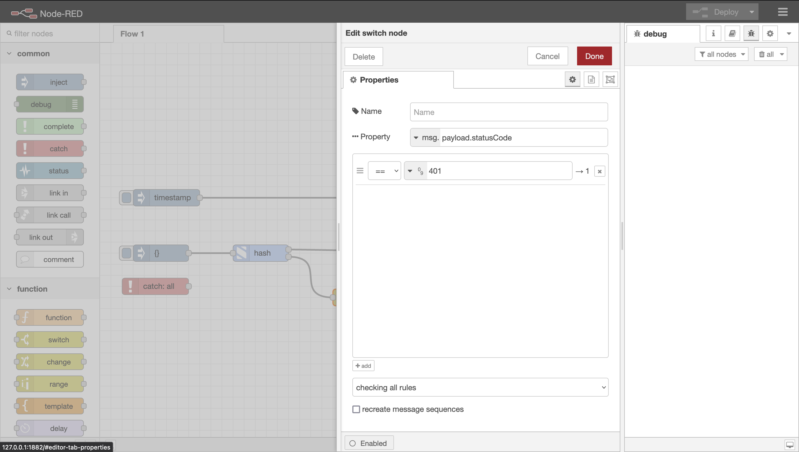

# node-red-s1seven-api

## Introduction

This is a custom node that wraps the S1Seven [API](https://developers.s1seven.com/docs/openapi/) in several custom nodes that can be used in Node-Red. There is a separate node available for each endpoint which can be found in the S1Seven category in the Palette on the left-hand side of the screen.

The endpoints that are currently available are `hash`, `validate`, `notarize`, `get a company by id` and `get identities`. All of these nodes share a single `config` node, which allows you to easily set the `access token`, `company id`, `mode` and `environment`.

## Usage

To notarize, hash or validate a certificate, simply pass in a valid JSON certificate as `msg.payload` or add it to `global.certificate`. Each node is thoroughly documented with a help text in the sidebar. To access it, select an S1Seven node, and click on the book icon on the top right of the screen (underneath the `Deploy` button). There you can see what input is required by each individual node.

Each node simply takes the required input via the config ui or the `msg` object, and outputs the `data` property of the response.

## Authentication

To authenticate a request, the api nodes look for an access token in the `msg.accessToken` property or in the global context `s1sevenAccessToken` property. The access token is automatically set in the global context when a request is made from the `get access token` node. To use the `get access token` node, simply add your application `clientId` and `clientSecret` to the config node, and send a request. To learn more, click [here](https://manual.s1seven.com/automation/#applications-and-access-tokens).

Access tokens expire after 24 hours. There are several ways to automate the renewal of access tokens, one example can be seen below:


In the screenshot, each api node has 2 outputs, the first labeled `success`, and the second `fail`. The `fail` output is linked to a `switch` node. The `switch` looks at the property `msg.payload.statusCode` and checks to see if the code is `401`, which means the request is unauthorized. If the code is `401`, it sends the payload to the `get access token` node, which automatically request a new access token and makes available in the global context, along with the `mode`.



The above workflow can be imported using the following JSON file:

```json
[
    {
        "id": "4e8475bd9d88ccaf",
        "type": "inject",
        "z": "155da1287ae6504d",
        "name": "",
        "props": [
            {
                "p": "payload"
            },
            {
                "p": "topic",
                "vt": "str"
            }
        ],
        "repeat": "",
        "crontab": "",
        "once": false,
        "onceDelay": 0.1,
        "topic": "",
        "payload": "",
        "payloadType": "json",
        "x": 90,
        "y": 160,
        "wires": [
            [
                "c45debacc2a6a70b"
            ]
        ]
    },
    {
        "id": "c45debacc2a6a70b",
        "type": "generate pdf",
        "z": "155da1287ae6504d",
        "name": "",
        "x": 270,
        "y": 160,
        "wires": [
            [
                "f4e5f3e835b0632a"
            ]
        ]
    },
    {
        "id": "e2b2aaef3e997b7b",
        "type": "hash",
        "z": "155da1287ae6504d",
        "name": "",
        "apiConfig": "16bd3e4db46db980",
        "algorithm": "sha256",
        "encoding": "hex",
        "x": 250,
        "y": 220,
        "wires": [
            [
                "f4e5f3e835b0632a"
            ],
            [
                "bde10a89215b14f9"
            ]
        ]
    },
    {
        "id": "b9aa8a443bc11d6a",
        "type": "inject",
        "z": "155da1287ae6504d",
        "name": "",
        "props": [
            {
                "p": "payload"
            }
        ],
        "repeat": "",
        "crontab": "",
        "once": false,
        "onceDelay": 0.1,
        "topic": "",
        "payload": "",
        "payloadType": "json",
        "x": 90,
        "y": 220,
        "wires": [
            [
                "e2b2aaef3e997b7b"
            ]
        ]
    },
    {
        "id": "f4e5f3e835b0632a",
        "type": "debug",
        "z": "155da1287ae6504d",
        "name": "debug 2",
        "active": true,
        "tosidebar": true,
        "console": false,
        "tostatus": false,
        "complete": "true",
        "targetType": "full",
        "statusVal": "",
        "statusType": "auto",
        "x": 740,
        "y": 160,
        "wires": []
    },
    {
        "id": "bf244ddf9e6921e1",
        "type": "verify certificate",
        "z": "155da1287ae6504d",
        "name": "",
        "apiConfig": "16bd3e4db46db980",
        "mode": "test",
        "x": 280,
        "y": 280,
        "wires": [
            [
                "f4e5f3e835b0632a"
            ],
            [
                "bde10a89215b14f9"
            ]
        ]
    },
    {
        "id": "9698e29aaaaa4348",
        "type": "notarize certificate",
        "z": "155da1287ae6504d",
        "name": "",
        "apiConfig": "16bd3e4db46db980",
        "identity": "",
        "x": 290,
        "y": 340,
        "wires": [
            [
                "f4e5f3e835b0632a"
            ],
            [
                "bde10a89215b14f9"
            ]
        ]
    },
    {
        "id": "5c6b42a2f30f1b60",
        "type": "get identities",
        "z": "155da1287ae6504d",
        "name": "",
        "apiConfig": "16bd3e4db46db980",
        "coinType": "",
        "status": "",
        "BIP44Account": "",
        "BIP44Index": "",
        "x": 270,
        "y": 400,
        "wires": [
            [
                "f4e5f3e835b0632a"
            ],
            [
                "bde10a89215b14f9"
            ]
        ]
    },
    {
        "id": "e68a61e1d99aa19b",
        "type": "get company",
        "z": "155da1287ae6504d",
        "name": "",
        "apiConfig": "16bd3e4db46db980",
        "x": 270,
        "y": 460,
        "wires": [
            [
                "f4e5f3e835b0632a"
            ],
            [
                "bde10a89215b14f9"
            ]
        ]
    },
    {
        "id": "52e91865d7b24a47",
        "type": "inject",
        "z": "155da1287ae6504d",
        "name": "",
        "props": [
            {
                "p": "payload"
            }
        ],
        "repeat": "",
        "crontab": "",
        "once": false,
        "onceDelay": 0.1,
        "topic": "",
        "payload": "",
        "payloadType": "json",
        "x": 90,
        "y": 340,
        "wires": [
            [
                "9698e29aaaaa4348"
            ]
        ]
    },
    {
        "id": "65458115caa044ab",
        "type": "inject",
        "z": "155da1287ae6504d",
        "name": "",
        "props": [
            {
                "p": "payload"
            }
        ],
        "repeat": "",
        "crontab": "",
        "once": false,
        "onceDelay": 0.1,
        "topic": "",
        "payload": "",
        "payloadType": "json",
        "x": 90,
        "y": 280,
        "wires": [
            [
                "bf244ddf9e6921e1"
            ]
        ]
    },
    {
        "id": "6354eeaa4378fbd6",
        "type": "inject",
        "z": "155da1287ae6504d",
        "name": "",
        "props": [
            {
                "p": "payload"
            },
            {
                "p": "topic",
                "vt": "str"
            }
        ],
        "repeat": "",
        "crontab": "",
        "once": false,
        "onceDelay": 0.1,
        "topic": "",
        "payload": "",
        "payloadType": "date",
        "x": 100,
        "y": 400,
        "wires": [
            [
                "5c6b42a2f30f1b60"
            ]
        ]
    },
    {
        "id": "5e5d581b5cb4f9e6",
        "type": "inject",
        "z": "155da1287ae6504d",
        "name": "",
        "props": [
            {
                "p": "payload"
            },
            {
                "p": "topic",
                "vt": "str"
            }
        ],
        "repeat": "",
        "crontab": "",
        "once": false,
        "onceDelay": 0.1,
        "topic": "",
        "payload": "",
        "payloadType": "date",
        "x": 100,
        "y": 460,
        "wires": [
            [
                "e68a61e1d99aa19b"
            ]
        ]
    },
    {
        "id": "d2dec5e7fe05263b",
        "type": "get access token",
        "z": "155da1287ae6504d",
        "name": "",
        "apiConfig": "16bd3e4db46db980",
        "x": 310,
        "y": 520,
        "wires": [
            [
                "f4e5f3e835b0632a"
            ],
            [
                "bde10a89215b14f9"
            ]
        ]
    },
    {
        "id": "63d67d150defcd23",
        "type": "inject",
        "z": "155da1287ae6504d",
        "name": "",
        "props": [
            {
                "p": "payload"
            },
            {
                "p": "topic",
                "vt": "str"
            }
        ],
        "repeat": "3600",
        "crontab": "",
        "once": false,
        "onceDelay": 0.1,
        "topic": "",
        "payload": "",
        "payloadType": "date",
        "x": 110,
        "y": 520,
        "wires": [
            [
                "d2dec5e7fe05263b"
            ]
        ]
    },
    {
        "id": "cc4b8b332ebe310d",
        "type": "debug",
        "z": "155da1287ae6504d",
        "name": "debug 4",
        "active": true,
        "tosidebar": true,
        "console": false,
        "tostatus": false,
        "complete": "true",
        "targetType": "full",
        "statusVal": "",
        "statusType": "auto",
        "x": 740,
        "y": 640,
        "wires": []
    },
    {
        "id": "bde10a89215b14f9",
        "type": "link out",
        "z": "155da1287ae6504d",
        "name": "link out 1",
        "mode": "link",
        "links": [
            "21347b23f66aebe3"
        ],
        "x": 715,
        "y": 380,
        "wires": []
    },
    {
        "id": "21347b23f66aebe3",
        "type": "link in",
        "z": "155da1287ae6504d",
        "name": "Global error handler",
        "links": [
            "bde10a89215b14f9"
        ],
        "x": 235,
        "y": 640,
        "wires": [
            [
                "8bf581ead2d78998"
            ]
        ]
    },
    {
        "id": "8bf581ead2d78998",
        "type": "switch",
        "z": "155da1287ae6504d",
        "name": "",
        "property": "payload.statusCode",
        "propertyType": "msg",
        "rules": [
            {
                "t": "eq",
                "v": "401",
                "vt": "num"
            }
        ],
        "checkall": "true",
        "repair": false,
        "outputs": 1,
        "x": 350,
        "y": 640,
        "wires": [
            [
                "d17dfbc84481cb5e"
            ]
        ],
        "outputLabels": [
            "401"
        ]
    },
    {
        "id": "eeddf96a0ce10b79",
        "type": "catch",
        "z": "155da1287ae6504d",
        "name": "",
        "scope": null,
        "uncaught": false,
        "x": 80,
        "y": 580,
        "wires": [
            []
        ]
    },
    {
        "id": "d17dfbc84481cb5e",
        "type": "get access token",
        "z": "155da1287ae6504d",
        "name": "",
        "apiConfig": "16bd3e4db46db980",
        "x": 550,
        "y": 600,
        "wires": [
            [
                "cc4b8b332ebe310d"
            ],
            [
                "cc4b8b332ebe310d"
            ]
        ]
    },
    {
        "id": "16bd3e4db46db980",
        "type": "api-config",
        "environment": "staging",
        "companyId": "",
        "name": "",
        "clientId": "",
        "clientSecret": "",
        "apiVersion": "1"
    }
]
```

## Development

For development and testing purposes, the URL can be overridden by adding a `.env` file with an `S1SEVEN_BASE_URL` property. For example, having `S1SEVEN_BASE_URL="http://localhost:4200"` in your `.env` file will mean `http://localhost:4200` is used instead of the default URL. If the `S1SEVEN_BASE_URL` property is not present in your `.env` file, the default URL will be used.
NOTE: If `S1SEVEN_BASE_URL` is present in the `.env` file, the tests will fail. Remove the property if necessary so the tests will pass.

The `constants.js` file can be found in the `resources` folder, as that allows the variables to be shared with the frontend using Node-Red.
